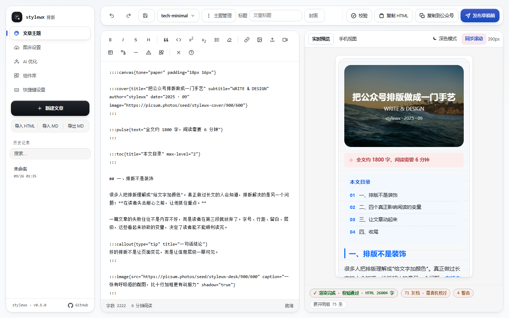

# stylewx

<p align="left">
  <a href="LICENSE"></a>
  <a href="https://www.npmjs.com/package/@stylewx/mcp-server"></a>
  <a href="https://github.com/wjunhere/stylewx"></a>
  
  
</p>

<p align="center">
  
</p>

公众号排版服务，提供 MCP Server 与 REST API。Kimi Code、Claude Code、Cursor、Pi、Codex 等 Agent
可以用它把 Markdown 排成一篇可发布的公众号文章——**既可以整篇一步到位，也可以拆成小原语分步迭代**：
定主题 → 写富组件 → 逐段验证 → 发布草稿箱 → 交给人本地微调。

本项目只负责排版和发布草稿，不负责正文写作。另有一个可选的本地 Web 编辑器，在 HTTP 模式下开在
`/editor`，用于人工排版、主题调试和最后收尾。

## 功能

- **15 个 MCP 工具**：主题管理、组件查询/**自定义组件**、分析/生成/**微调**主题、**片段**/整篇渲染、校验、发布、**落盘交接**。
  既可以整篇一步到位，也可以拆成小原语逐步迭代（见 [排版工作流](#排版工作流)）。
- 22 个内置富组件 + **可自定义新组件**（用 HTML 模板定义，存本地组件库，用 `:::名字` 调用）：图片图注/多图网格/图文卡片/自动轮播、卡片/时间线/步骤条/对比/引用卡/目录、
  分割线/章节标题/标签/提示框/背景/画布/描边动画、点击展开/进度条/呼吸强调、封面/结尾卡片。
  用 `:::card{title="…"}` … `:::` 语法书写，可嵌套，正文继续用 Markdown；
  组件样式可按「组件 → 部位」精确覆盖（见下）。
- 26 套预置主题（6 套原创 + 20 套 WeMD 移植），支持保存自定义主题和 LLM 生成主题。
- 三档微信 CSS 白名单，经真实草稿 API 实测校准；输出全部为内联样式，不依赖 `<style>` / `<link>` / `class`。
- 动态交互全部是内联 SVG + SMIL（微信正文禁 JS），点击展开、自动轮播、进度生长在读者端真实生效。
- `core` / `theme` / `validator` 不依赖 DOM 和 Node 独有 API，可独立复用；微信 API 调用集中在 `publisher`。
- 三种接入方式：MCP（stdio / Streamable HTTP）、REST API、本地 Web 编辑器。
- 只发布草稿箱，不实现群发；微信和 LLM 凭据只从环境变量读取。

## 架构

```
┌──────────── Agent（Kimi / Claude / Cursor / Pi / Codex）────────────┐
│  list_themes · list_saved_themes · generate_theme · tweak_theme      │
│  save_theme · export_theme · list_components                         │
│  analyze_article · render_fragment · render_preview · validate_article│
│  publish_draft · save_article · save_component · delete_component    │
└──────────────┬──────────────────────────┬───────────────────────────┘
         MCP (stdio / Streamable HTTP)         REST API (/themes … /drafts)
               │                                │
               └────────────┬───────────────────┘
                      @stylewx/service（共享 service 层）
        ┌──────────────┬────────────┬───────────┬───────────────┬──────────────┐
   components 富组件  core 渲染内核  theme 主题  validator 校验  publisher 发布  preview 截图
```

### 目录结构

```
stylewx/
├── packages/
│   ├── components/  # 富组件库：::: 指令解析 + 22 个组件渲染器 + HTML 反向导入 + 组件目录（同构）
│   ├── core/        # Markdown → 内联样式 HTML（unified/remark/rehype + juice），纯函数
│   ├── theme/       # 主题 zod Schema（含 JSON Schema 导出）、微信 CSS 白名单、主题→CSS 编译器、26 套预置主题
│   ├── validator/   # 微信兼容性校验器，输出结构化报告 { pass, issues }
│   ├── publisher/   # 微信 API：access_token / 素材上传 / draft.add + 外链图片搬运（含 SVG <image>）；不含群发
│   ├── preview/     # Playwright 截图（iPhone 视口 390px）
│   └── service/     # 共享 service 层，被 MCP 与 REST 复用
├── apps/
│   ├── mcp-server/  # MCP Server：stdio + Streamable HTTP 双传输（含本地 Web 编辑器）
│   └── api/         # REST API（Hono），与 MCP tools 一一对应
├── examples/        # mcp.json / mcp-http.json 示例 + component-showcase.md
└── docs/            # 设计说明与组件参考
```

## 快速开始

要求 Node.js ≥ 20、pnpm ≥ 10。

```bash
pnpm install                       # 安装依赖
pnpm build                         # 全量构建
pnpm test                          # 全量测试
cp .env.example .env               # 配置 WECHAT_* 与 LLM_*

# 可选：render_preview 截图需要 Chromium
pnpm --filter @stylewx/preview exec playwright install chromium
```

## 接入方式

### MCP（Agent 接入）

直接用 npm 包，或使用仓库内构建产物：

```bash
npx -y @stylewx/mcp-server                  # 免安装运行（stdio）
npm i -g @stylewx/mcp-server                # 全局安装
stylewx-mcp                                 # stdio
stylewx-mcp --transport http --port 3777    # HTTP（同时开 /editor）
```

MCP 配置示例（`.mcp.json` 或各 Agent 的 MCP 配置）：

```json
{
  "mcpServers": {
    "stylewx": {
      "command": "npx",
      "args": ["-y", "@stylewx/mcp-server"],
      "env": {
        "WECHAT_APP_ID": "…",
        "WECHAT_APP_SECRET": "…",
        "LLM_BASE_URL": "…",
        "LLM_API_KEY": "…",
        "LLM_MODEL": "…"
      }
    }
  }
}
```

Windows 下把 `command` 改为 `"cmd"`，`args` 改为 `["/c", "npx", "-y", "@stylewx/mcp-server"]`。

各 Agent 的配置文件位置：

| Agent | 配置文件 |
| --- | --- |
| Claude Desktop | macOS `~/Library/Application Support/Claude/claude_desktop_config.json`；Windows `%APPDATA%\Claude\claude_desktop_config.json` |
| Cursor | 项目根 `.cursor/mcp.json` |
| Kimi Code | `~/.kimi/…/mcp.json` 或项目级配置 |
| Pi | `~/.pi/agent/mcp.json`（`mcpServers.stylewx`） |
| Codex | `~/.codex/config.toml` → `[mcp_servers.stylewx]` |
| 远程 HTTP | `{ "mcpServers": { "stylewx": { "type": "http", "url": "http://localhost:PORT/mcp" } } }` |

stdio 与 Streamable HTTP 二选一即可。

### 本地 Web 编辑器

编辑器只在 `--transport http` 模式下提供。Agent 里配置的 `stylewx` 走 stdio，没有界面；
要用编辑器需要另起一个 HTTP 模式实例，两者可以共存。

```bash
pnpm stylewx:editor                                   # 自动加载仓库根 .env，默认端口 3777
node apps/mcp-server/scripts/editor.mjs [.env路径] [端口]   # 手动指定
```

Windows 也可以直接双击仓库根的 `stylewx-editor.bat`。启动后打开
http://localhost:3777/editor，同一进程还提供 http://localhost:3777/mcp。

编辑器功能：左栏 Markdown 编辑与富文本工具栏（标题/列表/警告框/上下标等）、
富组件插入面板（内置 22 个 + **agent 定义的自定义组件**，可在面板里直接删除）、
主题选择/生成/保存、右栏 390px 实时预览、左右栏同步滚动（可开关，偏好持久化）、校验、
复制 HTML 或复制到公众号、一键发布草稿箱、历史记录与图床设置，
以及 **导入 HTML（带组件标记时精确还原为 `:::` 指令）/ 导入 Markdown / 导出 Markdown**，
并支持 `?file=<路径>` 直接打开项目里的 `.md`（`save_article` 的交接入口）。

### REST API

```bash
pnpm --filter @stylewx/api dev
# http://localhost:3001
# GET /themes · POST /render · POST /validate · POST /drafts · POST /themes/generate
```

## 富组件

文章正文用 `:::` 指令插入组件，组件可嵌套（外层用更多冒号），内部继续写 Markdown：

```markdown
::::canvas{tone="paper"}

:::cover{title="文章标题" subtitle="SUBTITLE" author="作者"}
:::

:::section-title{index="01" title="第一节"}
:::

:::gallery{cols="3" caption="一组配图"}


:::

:::carousel{height="200" interval="3"}


:::

:::reveal{label="点击查看答案"}
答案会在点击后淡入。
:::

:::end-card{title="感谢阅读"}
:::

::::
```

组件样式可由主题统一定制：`components.<组件名>.<部位>` 可覆盖 `root`（最外层）、`*`（内部所有元素）
与语义部位（`title` / `body` / `footer` …），也可用实例级 `style` 一次性微调；
自由度只受微信白名单限制。细节见 [docs/COMPONENTS.md](./docs/COMPONENTS.md)。

完整组件清单、参数与微信端约束见 [docs/COMPONENTS.md](./docs/COMPONENTS.md)，
或调用 MCP 工具 `list_components`。完整示例见 [examples/component-showcase.md](./examples/component-showcase.md)。

渲染出的 HTML 带 `data-swx` 标记，可再导回编辑器继续编辑（组件会还原成 `:::` 指令）：

```bash
# 本地往返：渲染 → 回导 → 再渲染，比对组件与文本
node --env-file=.env apps/mcp-server/scripts/verify-html-roundtrip.mjs

# 真实微信往返：发布 → 取回 → 回导
node --env-file=.env apps/mcp-server/scripts/verify-wechat-showcase.mjs
```

## 排版工作流

MCP 不要求一次成稿。可以把它当一组**小原语**用，让 agent 分步做、人在本地收尾：

```
analyze_article                                判断内容类型/基调
list_themes → tweak_theme / generate_theme     先定主题骨架，再微调
list_components                                查可用组件与参数
  ↓ 分节推进（而不是一次成稿）
写一节 → render_fragment 验证 → 调整 → 写下一节
  ↓ 收口
render_preview 整篇校验 → publish_draft 发草稿箱
  ↓ 交接
save_article → 返回 editorUrl → 你在本地编辑器微调
```

三个小原语的分工：

- `render_fragment` 只渲染一段，且默认**不返回 HTML**，逐段迭代不把上下文塞满
- `tweak_theme` 是确定性的，改颜色/字号/圆角**不需要重新生成整包主题**
- `save_article` 落盘并返回 `http://localhost:3777/editor?file=<路径>`，点开就是可编辑的 Markdown

仓库内置了给 agent 用的 skill：[`.agents/skills/stylewx-article/SKILL.md`](./.agents/skills/stylewx-article/SKILL.md)，
含完整工作流、组件选型速查与微信端避坑清单。项目被信任后会自动发现；
想在所有项目里使用，把整个目录复制到 `~/.pi/agent/skills/stylewx-article/` 即可。

## MCP 工具

**主题**

| Tool | 用途 | 关键输入 |
| --- | --- | --- |
| `list_themes` | 列出预置 + 已保存主题（含完整 token/block，可直接复用） | — |
| `list_saved_themes` | 列出本地已保存的自定义/AI 主题（`~/.stylewx/themes.json`） | — |
| `generate_theme` | LLM 生成主题（可 `save` 存档），内置自检修复循环，失败时降级并标记 `fallback` | `prompt` / `article` / `baseTheme` / `save` |
| `tweak_theme` | 在现有主题上做**确定性微调**（改 token / Markdown 元素 CSS / **组件部位样式**），秒回、不烧 LLM | `theme`, `tokens` / `blocks` / `components` |
| `save_theme` | 保存主题到本地主题库（过 Schema + 微信白名单校验） | `theme` / `name` |
| `export_theme` | 导出主题为完整 JSON（已存/预置/对象） | `theme` |

**组件与排版**

| Tool | 用途 | 关键输入 |
| --- | --- | --- |
| `list_components` | 列出全部富组件及其语法与参数（可按类别过滤 / 输出 markdown 速查表） | `category` / `format` |
| `analyze_article` | 分析内容类型/基调/建议主题/阅读时长 | `markdown` |
| `render_fragment` | 只渲染**一段**，返回组件清单/诊断/校验/截图，默认**不返回 HTML** | `markdown`, `theme`, `includeHtml` |
| `render_preview` | 渲染整篇为内联样式 HTML + 校验报告 + iPhone(390px) 截图 | `markdown`, `theme` |
| `validate_article` | 校验微信兼容性，输出结构化报告 | `html` |

**发布与交接**

| Tool | 用途 | 关键输入 |
| --- | --- | --- |
| `publish_draft` | 发布到草稿箱（搬运外链图、上传封面） | `title`, `markdown`/`html`, `theme` 等 |
| `save_article` | 把最终 Markdown 落盘，返回可直接打开的编辑器地址（交接点） | `markdown`, `path`, `title` |

`theme` 参数支持预置主题名（如 `tech-minimal`）或完整主题 JSON；`render_preview` / `render_fragment` / `publish_draft` 均可用。

所有 tool 的错误统一为：

```json
{ "error": { "code": "invalid_theme", "message": "…", "hint": "…" } }
```

`hint` 用于提示 Agent 下一步该怎么做；缺少微信或 LLM 凭据时返回对应错误，不会静默失败。

## 环境变量

| 变量 | 说明 |
| --- | --- |
| `WECHAT_APP_ID` / `WECHAT_APP_SECRET` | 公众号凭据（`publish_draft` 必需） |
| `WECHAT_API_BASE` | 微信 API 基地址，默认 `https://api.weixin.qq.com` |
| `LLM_BASE_URL` / `LLM_API_KEY` / `LLM_MODEL` | OpenAI 兼容接口（`generate_theme` 和编辑器 AI 优化必需） |
| `LLM_API_STYLE` | LLM 调用风格，默认 `chat`；opencode go 用 `responses` |
| `PORT` | REST API 端口，默认 `3001` |
| `STYLEWX_THEMES_PATH` | 本地主题库路径，默认 `~/.stylewx/themes.json` |
| `STYLEWX_ARTICLES_DIR` | `save_article` / 编辑器 `?file=` 允许读写的根目录，默认当前工作目录 |
| `STYLEWX_EDITOR_URL` | `save_article` 返回的编辑器地址前缀，默认 `http://localhost:3777` |

缺少凭据时相关功能返回明确错误，其余功能正常。凭据只从环境变量注入。

## 边界与校验

- 只实现 `draft/add`（发布到草稿箱），未实现任何群发接口（`freepublish/submit`）。
- 内容进入草稿箱后仍需人工在公众号后台确认，本项目不提供绕过人工确认的自动化群发能力。
- 微信 AppSecret 与 LLM API Key 只通过环境变量注入，不硬编码、不提交。
- 输出 HTML 不含 `<style>` / `<link>` / `class` 依赖，样式全部内联（juice）。
- 主题 CSS 采用三档白名单（经真实微信草稿 API 实测校准）：`position` / `filter` 硬禁止；
  `transform` / `animation` / `float` / `box-shadow` / `flex` / `opacity` 等为灰色属性（微信保留但提示）；
  只有 `safe` 档无提示。
- 外链图（非 `mmbiz.qpic.cn`）会被校验器提示，`publish_draft` 会自动搬运到素材库（含 SVG `<image>`）。
- 校验器额外拦三类「微信端必然失效」的写法（均来自真实 `draft/add` → `draft/get` 实测）：
  页内锚点 `href="#…"`（errcode 45166）、依赖 `id` 属性（会被剥离）、SVG `url(#…)` 引用（id 被剥离后失效）。

## 示例脚本

```bash
# 排版一篇 Markdown（analyze → 生成主题 → 渲染 → 校验，输出到 <md>/typeset-out/）
node apps/mcp-server/scripts/typeset-article.mjs 文章.md "主题提示词"

# 渲染富组件示例文章（HTML + 390px 截图 + 校验报告）
node --env-file=.env apps/mcp-server/scripts/render-showcase.mjs

# 把渲染好的 HTML 发布到公众号草稿箱（缺封面时自动生成渐变封面）
node apps/mcp-server/scripts/publish-draft.mjs out/文章.html "标题"
```

### 验证脚本

```bash
# 模拟 agent 的分步工作流（真实 MCP stdio）：微调主题 → 逐段 → 整篇 → 落盘 → editorUrl 读回
node apps/mcp-server/scripts/verify-agent-workflow.mjs

# save_article 落盘 → 用 editorUrl 从编辑器端点读回（需编辑器在 3777 运行）
node --env-file=.env apps/mcp-server/scripts/verify-handoff.mjs

# 本地往返：渲染 → HTML 回导 → 再渲染，比对组件标记与纯文本
node --env-file=.env apps/mcp-server/scripts/verify-html-roundtrip.mjs

# 真实微信端到端：发布 → 取回 → 核对组件存活 + 回导还原
node --env-file=.env apps/mcp-server/scripts/verify-wechat-showcase.mjs

# 微信能力探针（往草稿箱写一条 [probe] 草稿并读回比对）
node --env-file=.env apps/mcp-server/scripts/probe-wechat-capabilities.mjs
node --env-file=.env apps/mcp-server/scripts/probe-wechat-data-attrs.mjs
```

### 编辑器 E2E（需编辑器在 3777 运行，依赖 Playwright）

```bash
node packages/preview/scripts/test-editor-import.mjs       # 导入 HTML
node packages/preview/scripts/test-editor-sync-scroll.mjs   # 左右栏同步滚动
node packages/preview/scripts/test-editor-handoff.mjs      # ?file= 交接 + 越权拒绝
node packages/preview/scripts/test-editor-components.mjs    # 富组件面板
node packages/preview/scripts/audit-showcase-layout.mjs     # 390px 布局审计
```

### 维护 README 配图

```bash
node packages/preview/scripts/capture-hero.mjs        # 重新截取 docs/assets/editor-preview.png
node packages/preview/scripts/verify-hero-image.mjs   # 校验配图不是空白/纯色
```

## 许可

MIT License，详见 [LICENSE](./LICENSE)。

## 致谢

代码为全新实现（MIT），不含参考项目源码。设计思路参考了以下开源项目（保留原作者版权声明）：

- [doocs/md](https://github.com/doocs/md) — Markdown → 微信 HTML 渲染 / juice 内联思路
- [WeMD](https://github.com/mdnice/WeMD) — 包拆分与主题设计器思路
- [caol64/wenyan-mcp](https://github.com/caol64/wenyan-mcp)（Apache-2.0）— 微信 API 封装 / MCP 远程模式
- `gzh-design-skill` — 主题 JSON 结构与微信兼容性规则清单
