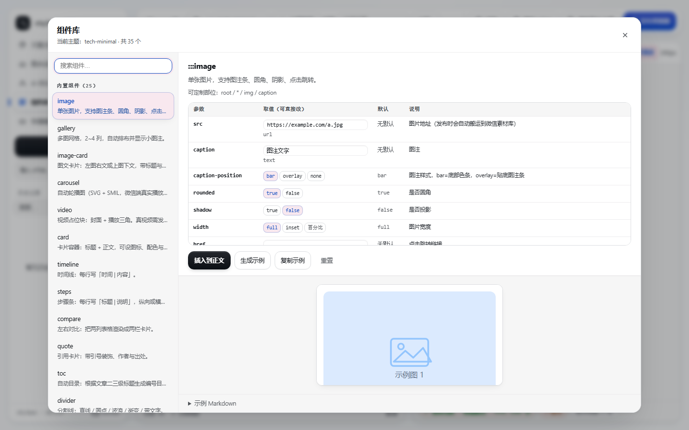

# stylewx

<p align="left">
  <a href="LICENSE"></a>
  <a href="https://www.npmjs.com/package/@stylewx/mcp-server"></a>
  <a href="https://github.com/wjunhere/stylewx"></a>
  
  
</p>

<p align="center">
  
</p>

公众号排版服务，提供 MCP Server 与 REST API。Kimi Code、Claude Code、Cursor、Pi、Codex 等 Agent
可以用它把 Markdown 排成一篇可发布的公众号文章——**既可以整篇一步到位，也可以拆成小原语分步迭代**：
定主题 → 写富组件 → 逐段验证 → 发布草稿箱 → 交给人本地微调。

本项目只负责排版和发布草稿，不负责正文写作。另有一个可选的本地 Web 编辑器，在 HTTP 模式下开在
`/editor`，用于人工排版、主题调试和最后收尾。

## 功能

- **22 个 MCP 工具**：主题管理、组件查询/**自定义组件**、分析/生成/**微调**主题、**片段**/整篇渲染、校验、发布、**落盘交接**，
  以及一整套**品牌记忆系统**（访谈建档 / 加载复用 / 迭代积累）和**发布前评审**。
  既可以整篇一步到位，也可以拆成小原语逐步迭代（见 [排版工作流](#排版工作流)）。
- **品牌记忆系统**：开工前先认品牌—— `brand_interview` 拿结构化问卷访谈，`brand_save` 把品牌
  固化为 `~/.stylewx/brands/<name>/`（`profile.json` 结构化真相源 + `brand.md` 人可读品牌宪法），
  `brand_apply` 一键加载复用（主题 + 品牌专属组件自动同步），`brand_learn` 把每篇的反馈记进档案。
  品牌越用越准：色板论证、语气规则、禁忌、专属组件、迭代记录都会沉淀下来。
- 22 个内置富组件 + **可自定义新组件**（用 HTML 模板定义，存本地组件库，用 `:::名字` 调用）：图片图注/多图网格/图文卡片/自动轮播、卡片/时间线/步骤条/对比/引用卡/目录、
  分割线/章节标题/标签/提示框/背景/画布/描边动画、点击展开/进度条/呼吸强调、封面/结尾卡片。
  用 `:::card{title="…"}` … `:::` 语法书写，可嵌套，正文继续用 Markdown；
  组件样式可按「组件 → 部位」精确覆盖（见下）。
- 26 套预置主题（6 套原创 + 20 套 WeMD 移植），支持保存自定义主题和 LLM 生成主题；
  主题支持 `decorations`（标题/引用前的真实内联装饰元素，绕开微信剥离伪元素）与 5 种 `canvas` 纹理背景。
- **设计由 agent 直出，MCP 只做校验/编译/存储/渲染**：agent 产出主题 JSON → `save_theme` / `brand_save` 校验落盘；
  `generate_theme`（烧 LLM）降级为无 agent 场景（REST API）的回退。主题的 blocks 可只写关键项，缺省自动补全。
- **发布前评审** `review_article`：确定性检查标题/正文层级比（h1≥2.0、h2≥1.5）、组件堆砌（类型 >6 种、密度 >4/千字）、主题独特性，
  并输出定性评审框架（Keep / Fix / Quick Wins + 眯眼测试）。
- 三档微信 CSS 白名单，经真实草稿 API 实测校准；输出全部为内联样式，不依赖 `<style>` / `<link>` / `class`。
- 动态交互全部是内联 SVG + SMIL（微信正文禁 JS），点击展开、自动轮播、进度生长在读者端真实生效。
- `core` / `theme` / `validator` 不依赖 DOM 和 Node 独有 API，可独立复用；微信 API 调用集中在 `publisher`。
- 三种接入方式：MCP（stdio / Streamable HTTP）、REST API、本地 Web 编辑器。
- 只发布草稿箱，不实现群发；微信和 LLM 凭据只从环境变量读取。

## 架构

```
┌─── Agent（Kimi Code / Claude Code / Cursor / Pi / Codex）───────────┐
│ 品牌：brand_interview · brand_save · brand_list                      │
│       brand_apply · brand_learn · brand_delete                       │
│ 主题：list_themes · list_saved_themes · save_theme · export_theme     │
│       generate_theme · tweak_theme                                   │
│ 组件：list_components · save_component · delete_component             │
│ 排版：analyze_article · render_fragment · render_preview              │
│       validate_article · review_article                              │
│ 发布：publish_draft · save_article                                    │
└──────────────┬──────────────────────────┬───────────────────────────┘
         MCP (stdio / Streamable HTTP)         REST API (/themes … /drafts)
               │                                │
               └────────────┬───────────────────┘
                      @stylewx/service（共享 service 层）
        ┌──────────────┬────────────┬───────────┬───────────────┬──────────────┐
   components 富组件  core 渲染内核  theme 主题  validator 校验  publisher 发布  preview 截图
```

### 目录结构

```
stylewx/
├── packages/
│   ├── components/  # 富组件库：::: 指令解析 + 22 个组件渲染器 + HTML 反向导入 + 组件目录（同构）
│   ├── core/        # Markdown → 内联样式 HTML（unified/remark/rehype + juice），纯函数
│   ├── theme/       # 主题 zod Schema（含 JSON Schema 导出）、微信 CSS 白名单、主题→CSS 编译器、26 套预置主题
│   ├── validator/   # 微信兼容性校验器，输出结构化报告 { pass, issues }
│   ├── publisher/   # 微信 API：access_token / 素材上传 / draft.add + 外链图片搬运（含 SVG <image>）；不含群发
│   ├── preview/     # Playwright 截图（iPhone 视口 390px）
│   └── service/     # 共享 service 层，被 MCP 与 REST 复用（含 brand-store 品牌记忆）
├── apps/
│   ├── mcp-server/  # MCP Server：stdio + Streamable HTTP 双传输（含本地 Web 编辑器）
│   └── api/         # REST API（Hono），与 MCP tools 一一对应
├── examples/        # mcp.json / mcp-http.json 示例 + component-showcase.md
└── docs/            # 设计说明与组件参考
```

## 快速开始

要求 Node.js ≥ 20、pnpm ≥ 10。

```bash
pnpm install                       # 安装依赖
pnpm build                         # 全量构建
pnpm test                          # 全量测试
cp .env.example .env               # 配置 WECHAT_* 与 LLM_*

# 可选：render_preview 截图需要 Chromium
pnpm --filter @stylewx/preview exec playwright install chromium
```

## 接入方式

### MCP（Agent 接入）

直接用 npm 包，或使用仓库内构建产物：

```bash
npx -y @stylewx/mcp-server                  # 免安装运行（stdio）
npm i -g @stylewx/mcp-server                # 全局安装
stylewx-mcp                                 # stdio
stylewx-mcp --transport http --port 3777    # HTTP（同时开 /editor）
```

MCP 配置示例（`.mcp.json` 或各 Agent 的 MCP 配置）：

```json
{
  "mcpServers": {
    "stylewx": {
      "command": "npx",
      "args": ["-y", "@stylewx/mcp-server"],
      "env": {
        "WECHAT_APP_ID": "…",
        "WECHAT_APP_SECRET": "…",
        "LLM_BASE_URL": "…",
        "LLM_API_KEY": "…",
        "LLM_MODEL": "…"
      }
    }
  }
}
```

Windows 下把 `command` 改为 `"cmd"`，`args` 改为 `["/c", "npx", "-y", "@stylewx/mcp-server"]`。

各 Agent 的配置文件位置：

| Agent | 配置文件 |
| --- | --- |
| Claude Desktop | macOS `~/Library/Application Support/Claude/claude_desktop_config.json`；Windows `%APPDATA%\Claude\claude_desktop_config.json` |
| Cursor | 项目根 `.cursor/mcp.json` |
| Kimi Code | `~/.kimi/…/mcp.json` 或项目级配置 |
| Pi | `~/.pi/agent/mcp.json`（`mcpServers.stylewx`） |
| Codex | `~/.codex/config.toml` → `[mcp_servers.stylewx]` |
| 远程 HTTP | `{ "mcpServers": { "stylewx": { "type": "http", "url": "http://localhost:PORT/mcp" } } }` |

stdio 与 Streamable HTTP 二选一即可。

### 本地 Web 编辑器

编辑器只在 `--transport http` 模式下提供。Agent 里配置的 `stylewx` 走 stdio，没有界面；
要用编辑器需要另起一个 HTTP 模式实例，两者可以共存。

```bash
pnpm stylewx:editor                                   # 自动加载仓库根 .env，默认端口 3777
node apps/mcp-server/scripts/editor.mjs [.env路径] [端口]   # 手动指定
```

Windows 也可以直接双击仓库根的 `stylewx-editor.bat`。启动后打开
http://localhost:3777/editor，同一进程还提供 http://localhost:3777/mcp。

编辑器功能：左栏 Markdown 编辑与富文本工具栏（标题/列表/警告框/上下标等）、
富组件插入面板 + **组件库预览页**（内置 22 个 + agent 自定义组件，按当前主题实时渲染，可插入/删除）、
**主题预览页**（用统一示例文章对比所有主题的排版与调色板，可一键应用）、
主题选择/生成/保存、右栏 390px 实时预览、左右栏同步滚动（可开关，偏好持久化）、校验、
复制 HTML 或复制到公众号、一键发布草稿箱、历史记录与图床设置，
以及 **导入 HTML（带组件标记时精确还原为 `:::` 指令）/ 导入 Markdown / 导出 Markdown**，
并支持 `?file=<路径>` 直接打开项目里的 `.md`（`save_article` 的交接入口）。

#### 主题随文章走：`.md` 的 front-matter

`save_article` 传了 `theme` 时，主题名会写进文章头部，并把 `&theme=` 附在返回的
`editorUrl` 上——用户点开链接就能直接看到排版后的效果，不用在下拉框里手选：

```markdown
---
title: 收敛水
theme: dusk-convergence
---

::::canvas{bg="#faf6f2" padding="28px 20px"}
...
```

规则：只认 `title` / `theme` 两个键；front-matter 块内没有已知键时会被当作普通
分割线（`---`）原样保留，不会误伤正文。编辑器在 `?file=` 载入与「导入 MD」两条路径上
都会解析它并自动选好主题（主题不存在时给提示，不会静默变成空选）。

#### 写回文件

顶部「保存到文件」下拉里的 **保存**（或 **Ctrl+S**）会把编辑器内容写回 `.md`，同时把当前的
`title` / `theme` 一起写进 front-matter；下拉里直接显示当前文件路径。只有通过 `?file=` 打开
或「另存为…」过一次才有目标路径；未关联文件时下拉标题变成「另存为…」并提示输入相对路径。

刻意**不做自动写盘**：编辑器里的改动先落 localStorage 快照，写回文件必须由人触发。
写入范围仍受 `STYLEWX_ARTICLES_DIR`（默认 cwd）限制，目录穿越会被拒绝。

#### 缩水护栏

`save_article` / `save-file` 默认**拒绍把一篇完整文章换成一小段内容**：原文件 ≥ 1KB
且新内容不足它的 25% 时返回 `content_shrunk`，**原文件分毫不动**。

这不是假想风险：开发过程中一次误点保存就把 12303 字节的文章写成了 71 字节，
全文丢掉且无任何提示。编辑器碰到这个错误会弹确认框，选择继续则带 `force: true` 重试。
真需要大幅删减时，`save_article` 传 `force: true` 即可。

### REST API

```bash
pnpm --filter @stylewx/api dev
# http://localhost:3001
# GET /themes · POST /render · POST /validate · POST /drafts · POST /themes/generate
```

## 富组件

文章正文用 `:::` 指令插入组件，组件可嵌套（外层用更多冒号），内部继续写 Markdown：

```markdown
::::canvas{tone="paper"}

:::cover{title="文章标题" subtitle="SUBTITLE" author="作者"}
:::

:::section-title{index="01" title="第一节"}
:::

:::gallery{cols="3" caption="一组配图"}


:::

:::carousel{height="200" interval="3"}


:::

:::reveal{label="点击查看答案"}
答案会在点击后淡入。
:::

:::end-card{title="感谢阅读"}
:::

::::
```

组件样式可由主题统一定制：`components.<组件名>.<部位>` 可覆盖 `root`（最外层）、`*`（内部所有元素）
与语义部位（`title` / `body` / `footer` …），也可用实例级 `style` 一次性微调；
自由度只受微信白名单限制。细节见 [docs/COMPONENTS.md](./docs/COMPONENTS.md)。

<p align="center">
  
</p>

编辑器内置「组件库」页：左侧列出全部组件（内置 + agent 自定义），右侧用**当前主题**实时渲染效果，
并可一键插入正文或复制示例。

完整组件清单、参数与微信端约束见 [docs/COMPONENTS.md](./docs/COMPONENTS.md)，
或调用 MCP 工具 `list_components`。完整示例见 [examples/component-showcase.md](./examples/component-showcase.md)。

渲染出的 HTML 带 `data-swx` 标记，可再导回编辑器继续编辑（组件会还原成 `:::` 指令）：

```bash
# 本地往返：渲染 → 回导 → 再渲染，比对组件与文本
node --env-file=.env apps/mcp-server/scripts/verify-html-roundtrip.mjs

# 真实微信往返：发布 → 取回 → 回导
node --env-file=.env apps/mcp-server/scripts/verify-wechat-showcase.mjs
```

## 品牌记忆系统

公众号排版最大的问题是「每次从零选模板」，排出来像任意一个号。品牌记忆系统把使用者的品牌资产固化成
可复用的排版档案，**每次迭代都沉淀下来**。

### 双轨档案

存在 `~/.stylewx/brands/<name>/`（可用 `STYLEWX_BRANDS_PATH` 覆盖）：

| 文件 | 作用 |
| --- | --- |
| `profile.json` | 结构化真相源：完整主题（主题名对齐品牌名）+ 品牌专属组件 + voice/taboos + learnings |
| `brand.md` | **人可读的「品牌宪法」**：定位、色彩论证、核心色板、语气规则、禁忌、专属组件、迭代记录。人可直接编辑，改完重新 `brand_save` 即生效 |

### 工作流

```
brand_list                          先看有没有档案
  ├─ 有 → brand_apply              拿到 theme + brand.md + 专属组件（组件自动同步进渲染库）
  └─ 无 → brand_interview          拿结构化问卷（定位/气质/色彩来源/资产/组件偏好）
             ↓ agent 一次性批量问用户
            agent 提炼设计（推导色板 → 写完整主题 + 专属组件）
             ↓
           brand_save               固化档案（主题/组件过 Schema + 微信白名单校验）
  ↓ 排版与发布
brand_learn                         把本次反馈记进档案（下次 brand_apply 会读到）
```

### 设计由 agent 产出，不烧 MCP 的 LLM

`brand_interview` 只返回问卷数据，`brand_save` 只做校验与落盘——**真正的设计（推导色板、写主题、写组件）由调用它的 agent 完成**。
色板必须写 `rationale`（色彩论证：采样自哪里、为什么是这个色，≥10 字），写不出来就说明在抄配方。

档案还支持 `logo` / `coverImage` / `headerComponent`：品牌头图（logo + 报名 + 期号，可用纯内联 SVG 实现）随档案固化，每篇文章开头自动复用。

对比测试（4 篇不同领域文章 × 4 组策略）见 [scripts/comparison/REPORT.md](./scripts/comparison/REPORT.md)：
基线 3/3 篇触发「与预置主题雷同」告警，引入三方向门 + 品牌记忆后降为 0，视觉亮度光谱方差从 ≈6 升到 ≈198。

## 排版工作流

MCP 不要求一次成稿。可以把它当一组**小原语**用，让 agent 分步做、人在本地收尾：

```
brand_list → brand_apply / brand_interview     先认品牌（无档案则访谈建档）
  ↓ 无档案时：三方向门
出 3 个不同温度的主题初稿（安静/中性/大胆）+ 截图 → 用户选
  ↓
analyze_article                                判断内容类型/基调
list_themes → tweak_theme / generate_theme     先定主题骨架，再微调
list_components                                查可用组件与参数
  ↓ 图文编排（不能只有纯文字 + 色块）
品牌头图 → cover → 每节至少一个视觉锚点（图片/数据条/动效/卡片）→ end-card
  ↓ 分节推进（而不是一次成稿）
写一节 → render_fragment 验证 → 调整 → 写下一节
  ↓ 收口
render_preview 整篇校验 → review_article 评审 → publish_draft 发草稿箱
  ↓ 交接与积累
save_article → editorUrl → 人在本地编辑器微调
brand_learn → 把这次学到的写进品牌档案
```

几个小原语的分工：

- `render_fragment` 只渲染一段，且默认**不返回 HTML**，逐段迭代不把上下文塞满
- `tweak_theme` 是确定性的，改颜色/字号/圆角**不需要重新生成整包主题**
- `review_article` 是确定性的（层级比 / 组件堆砌 / 独特性），定性评审（眯眼测试、AI 感）由 agent 基于截图完成
- `save_article` 落盘并返回 `http://localhost:3777/editor?file=<路径>`，点开就是可编辑的 Markdown

仓库内置了给 agent 用的 skill：[`.agents/skills/stylewx-article/SKILL.md`](./.agents/skills/stylewx-article/SKILL.md)，
含完整工作流、品牌访谈清单、三方向门、图文并茂硬性要求、组件选型速查与微信端避坑清单。项目被信任后会自动发现；
想在所有项目里使用，把整个目录复制到 `~/.pi/agent/skills/stylewx-article/` 即可。

## MCP 工具

**品牌记忆**

| Tool | 用途 | 关键输入 |
| --- | --- | --- |
| `brand_interview` | 返回品牌访谈问卷（定位/气质/色彩来源/资产/组件偏好），访谈由 agent 完成 | — |
| `brand_save` | 固化品牌档案（`profile.json` + `brand.md`）；主题与组件过 Schema + 白名单；`rationale` 必填 | `name`, `description`, `rationale`, `theme`, `components?`, `voice?`, `taboos?`, `logo?`, `headerComponent?` |
| `brand_list` | 列出已有品牌档案（摘要） | — |
| `brand_apply` | 加载档案：返回主题 + 品牌宪法 + 专属组件（组件自动同步进渲染库） | `name` |
| `brand_learn` | 追加一条迭代记录（写入 profile 与 brand.md） | `name`, `note` |
| `brand_delete` | 删除品牌档案目录 | `name` |

**主题**

| Tool | 用途 | 关键输入 |
| --- | --- | --- |
| `list_themes` | 列出预置 + 已保存主题（含完整 token/block，可直接复用） | — |
| `list_saved_themes` | 列出本地已保存的自定义/AI 主题（`~/.stylewx/themes.json`） | — |
| `generate_theme` | LLM 生成主题（可 `save` 存档），内置自检修复循环，失败时降级并标记 `fallback`；无 agent 场景的回退 | `prompt` / `article` / `baseTheme` / `save` |
| `tweak_theme` | 在现有主题上做**确定性微调**（改 token / Markdown 元素 CSS / **组件部位样式**），秒回、不烧 LLM | `theme`, `tokens` / `blocks` / `components` |
| `save_theme` | 保存主题到本地主题库（过 Schema + 微信白名单校验）；agent 直出主题的落盘入口 | `theme` / `name` |
| `export_theme` | 导出主题为完整 JSON（已存/预置/对象） | `theme` |

**组件与排版**

| Tool | 用途 | 关键输入 |
| --- | --- | --- |
| `list_components` | 列出全部富组件及其语法与参数（可按类别过滤 / 输出 markdown 速查表） | `category` / `format` |
| `analyze_article` | 分析内容类型/基调/建议主题/阅读时长 | `markdown` |
| `render_fragment` | 只渲染**一段**，返回组件清单/诊断/校验/截图，默认**不返回 HTML** | `markdown`, `theme`, `includeHtml` |
| `render_preview` | 渲染整篇为内联样式 HTML + 校验报告 + iPhone(390px) 截图 | `markdown`, `theme` |
| `validate_article` | 校验微信兼容性，输出结构化报告 | `html` |
| `review_article` | 发布前评审：层级比 / 组件堆砌 / 主题独特性 + 定性评审框架 | `markdown`, `theme` |
| `save_component` / `delete_component` | 定义 / 删除自定义富组件（模板保存前做微信校验） | `name`, `template` 等 |

**发布与交接**

| Tool | 用途 | 关键输入 |
| --- | --- | --- |
| `publish_draft` | 发布到草稿箱（搬运外链图、上传封面） | `title`, `markdown`/`html`, `theme` 等 |
| `save_article` | 把最终 Markdown 落盘，返回可直接打开的编辑器地址（交接点） | `markdown`, `path`, `title` |

`theme` 参数支持预置主题名（如 `tech-minimal`）或完整主题 JSON；`render_preview` / `render_fragment` / `publish_draft` 均可用。

所有 tool 的错误统一为：

```json
{ "error": { "code": "invalid_theme", "message": "…", "hint": "…" } }
```

`hint` 用于提示 Agent 下一步该怎么做；缺少微信或 LLM 凭据时返回对应错误，不会静默失败。

## 环境变量

| 变量 | 说明 |
| --- | --- |
| `WECHAT_APP_ID` / `WECHAT_APP_SECRET` | 公众号凭据（`publish_draft` 必需） |
| `WECHAT_API_BASE` | 微信 API 基地址，默认 `https://api.weixin.qq.com` |
| `LLM_BASE_URL` / `LLM_API_KEY` / `LLM_MODEL` | OpenAI 兼容接口（`generate_theme` 和编辑器 AI 优化必需） |
| `LLM_API_STYLE` | LLM 调用风格，默认 `chat`；opencode go 用 `responses` |
| `PORT` | REST API 端口，默认 `3001` |
| `STYLEWX_THEMES_PATH` | 本地主题库路径，默认 `~/.stylewx/themes.json` |
| `STYLEWX_COMPONENTS_PATH` | 本地自定义组件库路径，默认 `~/.stylewx/components.json` |
| `STYLEWX_BRANDS_PATH` | 品牌档案根目录，默认 `~/.stylewx/brands/` |
| `STYLEWX_ARTICLES_DIR` | `save_article` / 编辑器 `?file=` 允许读写的根目录，默认当前工作目录 |
| `STYLEWX_EDITOR_URL` | `save_article` 返回的编辑器地址前缀，默认 `http://localhost:3777` |

缺少凭据时相关功能返回明确错误，其余功能正常。凭据只从环境变量注入。

### 浏览器登录态发布（免 IP 白名单，含封面上传）

`publish_draft` 走微信 API，要求调用方 IP 在白名单内。若你的出口 IP 不固定（校园网 / 多出口 NAT），
可以用**浏览器登录态**发布：复用你已登录的浏览器，在公众号编辑器里写入富文本并点「保存为草稿」，
走后台自己的保存接口，**不受 `draft/add` 的 IP 白名单限制**。

```bash
# Markdown + 主题名（含封面自动上传）
node apps/mcp-server/scripts/publish-via-browser.mjs 文章.md --theme business --cover cover.jpg

# 用已渲染好的 HTML
node apps/mcp-server/scripts/publish-via-browser.mjs --html out/文章.html --title "标题" --cover cover.jpg

# 常用选项
#   --author <作者>   写入作者
#   --cover <图片>    封面图（自动上传素材库并设为封面）
#   --dry-run         只填写不保存
#   --session <名>    webbridge 会话名
```

前置条件：

1. 浏览器装 [Kimi WebBridge](https://www.kimi.com/zh-cn/features/webbridge) 扩展，已登录公众号后台
2. **Kimi 扩展必须开启「允许访问文件网址」**（`edge://extensions` → Kimi → 详细信息 → 允许访问文件网址）；
   否则上传封面会报 `upload needs Chrome's per-extension file access`
3. 守护进程未运行时脚本会自动启动

实测结论（微信新版编辑器）：

| 项 | 结果 |
| --- | --- |
| 正文写入 | `execCommand('insertHTML')` 有效，section/span + 内联样式完整保留 |
| 正文编辑器选择器 | `.rich_media_content .ProseMirror`（页面上有**两个** ProseMirror，另一个是标题框） |
| 外链图片 | 编辑器自动上传到素材库（src → `mmbiz.qpic.cn`） |
| 内联 SVG + SMIL 动画 | 完整保留 |
| **封面自动上传** | ✅ 可行：hover 显形封面操作组 → 图片库 → 上传文件 → 下一步 → 确认 |
| 保存草稿 | 点「保存为草稿」，成功时 URL 带 `appmsgid` |

封面流程的两个关键细节（踩过的坑）：

- 微信预渲染了**多份 `0×0` 的模板弹窗**，必须筛「尺寸 > 200」的那个才是可见实例；
  用错实例会导致“点击无任何反应”
- 封面专用 file input **只在封面弹窗打开时存在**，且与编辑器工具栏的插图 input 不同
  （封面那个的 `accept` 含 `image/bmp`）；传错会把封面图插进正文

> 发布前仍建议先 `render_preview` + `validate_article`（脚本内已自动校验，error 不为 0 会拒绝发布）。

#### ⚠️ 自动化点按钮的安全约束

本脚本**只用 snapshot 返回的元素 ref 点击，绝不用文本模糊匹配**。
原因：曾用 `--text "下一步"` 做语义定位，该参数在精确匹配失败时会**退化匹配**，
结果点到了页面上的「退出登录」，导致账号被登出。

脚本因此内置双名单：只允许点击 `保存为草稿 / 保存 / 下一步 / 确认 / 确定 / 完成`，
命中 `退出登录 / 删除 / 取消 / 关闭 / 群发 / 发表` 立即中止。
若你要写类似的自动化，请沿用这个约束。

## 常见问题

### `publish_draft` 报 40164 invalid ip … not in whitelist

微信要求调用方 IP 在白名单内（**设置与开发 → 基本配置 → IP 白名单**）。
若你的出口 IP 不固定（校园网 / 多出口 NAT / 移动网络），单个 IP 加白名单会被漂移绕过。
解法：让微信 API 流量走一个固定出口的代理（如 Clash 节点），把该节点出口 IP 加进去一次即可。
注意部分代理规则会把国内域名分流为直连（如 `GEOIP,CN → DIREC`），此时代理不生效，需要临时切成全局模式。

### 上传图片/封面报 41005 media data missing

已在 `@stylewx/publisher` 修复：不要用 Node 原生 `FormData` + `Blob`——
在 undici fetch（尤其挂 `ProxyAgent` dispatcher）下 body 会被吞掉，微信返回 41005。
现改为手动构造 multipart 字节体，在所有 fetch 实现下都稳定。

### 暗色整页主题背景不生效

`canvasBg` token 只有在正文用 `::::canvas` 包裹时才生效（否则是白底 + 暗色文字，读者完全不可读）。
设计暗场主题时，第一步就要把 canvas 包裹写进模板。

### 组件语法变成了一堆文字

`:::组件名` **必须在行首**，拼在段落句尾不会解析；组件前后都要空行。漏写闭合 `:::` 会把后面内容吞进去，
`render_fragment` 的 `diagnostics` 会提示。

## 边界与校验

- 只实现 `draft/add`（发布到草稿箱），未实现任何群发接口（`freepublish/submit`）。
- 内容进入草稿箱后仍需人工在公众号后台确认，本项目不提供绕过人工确认的自动化群发能力。
- 微信 AppSecret 与 LLM API Key 只通过环境变量注入，不硬编码、不提交。
- 输出 HTML 不含 `<style>` / `<link>` / `class` 依赖，样式全部内联（juice）。
- 主题 CSS 采用三档白名单（经真实微信草稿 API 实测校准）：`position` / `filter` 硬禁止；
  `transform` / `animation` / `float` / `box-shadow` / `flex` / `opacity` 等为灰色属性（微信保留但提示）；
  只有 `safe` 档无提示。
- 外链图（非 `mmbiz.qpic.cn`）会被校验器提示，`publish_draft` 会自动搬运到素材库（含 SVG `<image>`）。
- 校验器额外拦三类「微信端必然失效」的写法（均来自真实 `draft/add` → `draft/get` 实测）：
  页内锚点 `href="#…"`（errcode 45166）、依赖 `id` 属性（会被剥离）、SVG `url(#…)` 引用（id 被剥离后失效）。

## 示例脚本

```bash
# 排版一篇 Markdown（analyze → 生成主题 → 渲染 → 校验，输出到 <md>/typeset-out/）
node apps/mcp-server/scripts/typeset-article.mjs 文章.md "主题提示词"

# 渲染富组件示例文章（HTML + 390px 截图 + 校验报告）
node --env-file=.env apps/mcp-server/scripts/render-showcase.mjs

# 把渲染好的 HTML 发布到公众号草稿箱（缺封面时自动生成渐变封面）
node apps/mcp-server/scripts/publish-draft.mjs out/文章.html "标题"
```

### 验证脚本

```bash
# 模拟 agent 的分步工作流（真实 MCP stdio）：微调主题 → 逐段 → 整篇 → 落盘 → editorUrl 读回
node apps/mcp-server/scripts/verify-agent-workflow.mjs

# 品牌记忆 + 多组排版策略对比（4 篇文章 × 4 组策略，输出截图与量化指标）
node scripts/comparison/run.mjs
node scripts/comparison/rich-demo.mjs      # 富组件完整形态（品牌报头/封面/图表/动效/图卡）
```
# save_article 落盘 → 用 editorUrl 从编辑器端点读回（需编辑器在 3777 运行）
node --env-file=.env apps/mcp-server/scripts/verify-handoff.mjs

# 本地往返：渲染 → HTML 回导 → 再渲染，比对组件标记与纯文本
node --env-file=.env apps/mcp-server/scripts/verify-html-roundtrip.mjs

# 真实微信端到端：发布 → 取回 → 核对组件存活 + 回导还原
node --env-file=.env apps/mcp-server/scripts/verify-wechat-showcase.mjs

# 微信能力探针（往草稿箱写一条 [probe] 草稿并读回比对）
node --env-file=.env apps/mcp-server/scripts/probe-wechat-capabilities.mjs
node --env-file=.env apps/mcp-server/scripts/probe-wechat-data-attrs.mjs
```

### 编辑器 E2E（需编辑器在 3777 运行，依赖 Playwright）

```bash
node packages/preview/scripts/test-editor-import.mjs       # 导入 HTML
node packages/preview/scripts/test-editor-sync-scroll.mjs   # 左右栏同步滚动
node packages/preview/scripts/test-editor-handoff.mjs      # ?file= 交接 + 越权拒绝
node packages/preview/scripts/test-editor-components.mjs    # 富组件面板
node packages/preview/scripts/audit-showcase-layout.mjs     # 390px 布局审计
```

### 维护 README 配图

```bash
node packages/preview/scripts/capture-hero.mjs        # 重新截取 docs/assets/editor-preview.png
node packages/preview/scripts/verify-hero-image.mjs   # 校验配图不是空白/纯色
```

## 许可

MIT License，详见 [LICENSE](./LICENSE)。

## 致谢

代码为全新实现（MIT），不含参考项目源码。设计思路参考了以下开源项目（保留原作者版权声明）：

- [doocs/md](https://github.com/doocs/md) — Markdown → 微信 HTML 渲染 / juice 内联思路
- [WeMD](https://github.com/tenngoxars/WeMD)（MIT）— 包拆分与主题设计器思路；20 套预置主题移植自其内置主题，见 `scripts/port-wemd-themes.mjs`
- [caol64/wenyan-mcp](https://github.com/caol64/wenyan-mcp)（Apache-2.0）— 微信 API 封装 / MCP 远程模式
- `gzh-design-skill` — 主题 JSON 结构与微信兼容性规则清单
