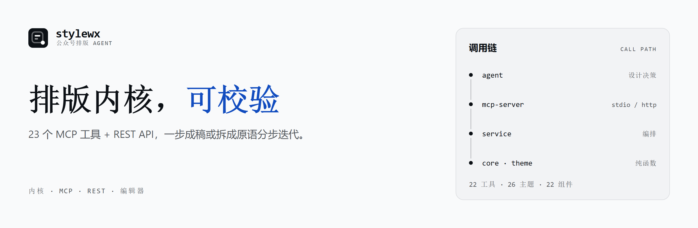

# stylewx

<p align="center">
  <picture>
    <source media="(max-width: 700px)" srcset="./docs/assets/banner-640x200.png">
    
  </picture>
</p>

<p align="left">
  <a href="LICENSE"></a>
  <a href="https://github.com/wjunhere/stylewx/actions/workflows/ci.yml"></a>
  <a href="https://www.npmjs.com/package/@stylewx/mcp-server"></a>
  
  
  
  
</p>

公众号排版服务，提供 MCP Server 与 REST API。Kimi Code、Claude Code、Cursor、Pi、Codex 等 Agent
可以用它把 Markdown 排成一篇可发布的公众号文章——**既可以整篇一步到位，也可以拆成小原语分步迭代**：
定主题 → 写富组件 → 逐段验证 → 发布草稿箱 → 交给人本地微调。

本项目只负责排版和发布草稿，不负责正文写作。另有一个可选的本地 Web 编辑器，在 HTTP 模式下开在
`/editor`，用于人工排版、主题调试和最后收尾。

<p align="center">
  
</p>

## 功能

- **23 个 MCP 工具**：品牌、主题、组件、排版、发布五组原语（见 [MCP 工具](#mcp-工具)），
  既能一步成稿，也能拆开逐步迭代。
- **品牌记忆系统**：品牌档案固化为可复用的排版资产，每次迭代都沉淀，越用越准（见 [品牌记忆系统](#品牌记忆系统)）。
- **23 个富组件 + 自定义组件**：图片图注 / 多图网格 / 图文卡片 / 自动轮播 / 时间线 / 步骤条 / 对比 /
  引用卡 / 目录 / 提示框 / 进度条 / 封面 / 结尾卡片等，用 `:::名字{参数}` 书写、可嵌套，正文继续用 Markdown；
  也能用 HTML 模板定义新组件存进本地组件库。
- **26 套预置主题**（6 套原创 + 20 套 WeMD 移植），支持保存自定义主题与 LLM 生成主题；
  主题的 blocks 可只写关键项，缺省自动补全。
- **发布前评审** `review_article`：确定性检查标题/正文层级比、组件堆砌、主题独特性，并给出定性评审框架。
- **设计由 agent 直出**：agent 产出主题 JSON → 校验落盘；`generate_theme`（烧 LLM）只是无 agent 场景的回退。
- **微信兼容有据可依**：三档 CSS 白名单经真实草稿 API 实测校准；输出全部内联样式，不依赖
  `<style>` / `<link>` / `class`；动态交互一律用内联 SVG + SMIL（正文禁 JS），读者端真实生效。
- `core` / `theme` / `validator` 不依赖 DOM 与 Node 独有 API，可独立复用；微信 API 调用集中在 `publisher`。
- 只发布到草稿箱，不实现群发；微信与 LLM 凭据只从环境变量读取。

## 架构

```
┌─── Agent（Kimi Code / Claude Code / Cursor / Pi / Codex）───────────┐
│  23 个 MCP 工具：品牌 · 主题 · 组件 · 排版 · 发布                     │
└──────────────┬──────────────────────────┬───────────────────────────┘
         MCP (stdio / Streamable HTTP)         REST API (/themes … /drafts)
               │                                │
               └────────────┬───────────────────┘
                      @stylewx/service（共享 service 层）
        ┌──────────────┬────────────┬───────────┬───────────────┬──────────────┐
   components 富组件  core 渲染内核  theme 主题  validator 校验  publisher 发布  preview 截图
```

```
stylewx/
├── packages/
│   ├── components/  # 富组件库：::: 指令解析 + 组件渲染器 + HTML 反向导入 + 组件目录（同构）
│   ├── core/        # Markdown → 内联样式 HTML（unified/remark/rehype + juice），纯函数
│   ├── theme/       # 主题 Schema、微信 CSS 白名单、主题→CSS 编译器、26 套预置主题
│   ├── validator/   # 微信兼容性校验器，输出结构化报告
│   ├── publisher/   # 微信 API：token / 素材上传 / draft.add + 外链图搬运（不含群发）
│   ├── preview/     # Playwright 截图（390px 视口）
│   └── service/     # 共享 service 层，被 MCP 与 REST 复用（含品牌记忆）
├── apps/
│   ├── mcp-server/  # MCP Server：stdio + Streamable HTTP（含本地 Web 编辑器）
│   └── api/         # REST API（Hono）
├── examples/        # mcp.json 示例 + component-showcase.md
├── scripts/         # ci 发布闸门 · brand 品牌资产 · comparison 排版策略对比
└── docs/            # DESIGN.md 设计决策 · COMPONENTS.md 组件参考
```

## 快速开始

要求 Node.js ≥ 20、pnpm ≥ 10。

```bash
pnpm install
pnpm build
cp .env.example .env               # 配置 WECHAT_* 与 LLM_*

# 可选：render_preview 截图需要 Chromium
pnpm --filter @stylewx/preview exec playwright install chromium
```

## 接入方式

### MCP（Agent 接入）

```bash
npx -y @stylewx/mcp-server                  # 免安装运行（stdio）
npm i -g @stylewx/mcp-server                # 全局安装
stylewx-mcp                                 # stdio
stylewx-mcp --transport http --port 3777    # HTTP（同时开 /editor）
```

MCP 配置示例：

```json
{
  "mcpServers": {
    "stylewx": {
      "command": "npx",
      "args": ["-y", "@stylewx/mcp-server"],
      "env": { "WECHAT_APP_ID": "…", "WECHAT_APP_SECRET": "…", "LLM_BASE_URL": "…", "LLM_API_KEY": "…", "LLM_MODEL": "…" }
    }
  }
}
```

Windows 下 `command` 改为 `"cmd"`、`args` 改为 `["/c", "npx", "-y", "@stylewx/mcp-server"]`。

配置文件位置：Claude Desktop 用 `claude_desktop_config.json`；Cursor 用项目根 `.cursor/mcp.json`；
Kimi Code 用 `~/.kimi/…/mcp.json`；Pi 用 `~/.pi/agent/mcp.json`；Codex 用 `~/.codex/config.toml` 的
`[mcp_servers.stylewx]`；远程 HTTP 写成 `{ "type": "http", "url": "http://localhost:PORT/mcp" }`。

### 本地 Web 编辑器

编辑器只在 `--transport http` 模式下提供。Agent 里配置的 `stylewx` 走 stdio、没有界面，
要用编辑器需另起一个 HTTP 实例，两者可以共存。

```bash
pnpm stylewx:editor                                   # 自动加载仓库根 .env，默认端口 3777
node apps/mcp-server/scripts/editor.mjs [.env路径] [端口]   # 手动指定
```

Windows 也可直接双击仓库根的 `stylewx-editor.bat`。打开 http://localhost:3777/editor ，
同一进程还提供 http://localhost:3777/mcp 。

功能：Markdown 编辑与工具栏、富组件插入面板 + **组件库预览页**（按当前主题实时渲染）、
**主题预览页**（统一示例文章对比全部主题）、主题选择/生成/保存、390px 实时预览、
左右栏同步滚动、校验、复制 HTML / 复制到公众号、发布草稿箱、历史记录与图床设置，
以及导入 HTML（带组件标记时精确还原为 `:::` 指令）/ 导入 Markdown / 导出 Markdown。

**主题随文章走**：`save_article` 传了 `theme` 时会写进文章头的 front-matter，并附
`&theme=` 在返回的 `editorUrl` 上，用户点开就是排好版的效果：

```markdown
---
title: 收敛水
theme: dusk-convergence
---
```

只认 `title` / `theme` 两个键；块内没有已知键时按普通分割线原样保留。
顶部「保存到文件」（Ctrl+S）会把内容写回 `.md` 并同步这两个键；**刻意不做自动写盘**，
写回必须由人触发，且写入范围受 `STYLEWX_ARTICLES_DIR` 限制。
若新内容不足原文件的 25%，`save_article` 会返回 `content_shrunk` 并**分毫不动原文件**——
这条护栏来自一次误点把 12303 字节的文章写成 71 字节的事故。

### REST API

```bash
pnpm --filter @stylewx/api dev      # http://localhost:3001
# GET /themes · POST /render · POST /validate · POST /drafts · POST /themes/generate
```

## 富组件

正文用 `:::` 指令插入组件，可嵌套（外层用更多冒号），内部继续写 Markdown：

```markdown
::::canvas{tone="paper"}

:::cover{title="文章标题" subtitle="SUBTITLE" author="作者"}
:::

:::gallery{cols="3" caption="一组配图"}

:::

:::reveal{label="点击查看答案"}
答案会在点击后淡入。
:::

:::end-card{title="感谢阅读"}
:::

::::
```

组件样式可由主题统一定制：`components.<组件名>.<部位>` 可覆盖 `root`（最外层）、`*`（内部所有元素）
与语义部位（`title` / `body` / `footer` …），也可用实例级 `style` 一次性微调；
自由度只受微信白名单限制。渲染出的 HTML 带 `data-swx` 标记，可再导回编辑器继续编辑。

<p align="center">
  
</p>

完整的组件清单、参数与微信端约束见 [docs/COMPONENTS.md](./docs/COMPONENTS.md)，
或调用 `list_components`；完整示例见 [examples/component-showcase.md](./examples/component-showcase.md)。

## 品牌记忆系统

公众号排版最大的问题是「每次从零选模板」，排出来像任意一个号。品牌记忆系统把品牌资产固化成
可复用的排版档案：定位、色彩论证、核心色板、语气规则、禁忌、专属组件、迭代记录都会沉淀下来。

存在 `~/.stylewx/brands/<name>/`（可用 `STYLEWX_BRANDS_PATH` 覆盖），双轨：

| 文件 | 作用 |
| --- | --- |
| `profile.json` | 结构化真相源：完整主题 + 品牌专属组件 + voice/taboos + learnings |
| `brand.md` | **人可读的「品牌宪法」**，人可直接编辑，改完重新 `brand_save` 即生效 |

```
brand_list                          先看有没有档案
  ├─ 有 → brand_apply              拿到 theme + brand.md + 专属组件（自动同步进渲染库）
  └─ 无 → brand_interview          拿结构化问卷（定位/气质/色彩来源/资产/组件偏好）
             ↓ agent 一次性批量问用户，再提炼设计（推导色板 → 写主题 + 专属组件）
           brand_save               固化档案（过 Schema + 微信白名单校验）
  ↓ 排版与发布
brand_learn                         把本次反馈记进档案（下次 brand_apply 会读到）
```

**设计由 agent 产出，不烧 MCP 的 LLM**：`brand_interview` 只返回问卷、`brand_save` 只做校验落盘，
真正的设计由调用它的 agent 完成。色板必须写 `rationale`（采样自哪里、为什么是这个色，≥10 字），
写不出来就说明在抄配方。

## 排版工作流

MCP 不要求一次成稿，可以当一组**小原语**用，让 agent 分步做、人在本地收尾：

```
brand_list → brand_apply / brand_interview     先认品牌（无档案则访谈建档）
  ↓ 无档案时：出 3 个不同温度的主题初稿 + 截图 → 用户选
analyze_article                                判断内容类型/基调
list_themes → tweak_theme / generate_theme     先定骨架，再微调
list_components                                查可用组件与参数
  ↓ 图文编排：封面 → 每节至少一个视觉锚点（图片/数据条/动效/卡片）→ 结尾卡片
  ↓ 分节推进：写一节 → render_fragment 验证 → 调整 → 写下一节
render_preview 整篇校验 → review_article 评审 → publish_draft 发草稿箱
  ↓ 交接与积累
save_article → editorUrl → 人在本地编辑器微调 → brand_learn 记进档案
```

几个原语的分工：`render_fragment` 只渲染一段且默认不返回 HTML，逐段迭代不塞满上下文；
`tweak_theme` 是确定性的，改颜色/字号/圆角不需要重新生成整包主题；
`review_article` 的确定性部分（层级比 / 组件堆砌 / 独特性）由代码算，定性部分（眯眼测试、AI 感）
由 agent 基于截图完成。

仓库内置了给 agent 用的 skill：[`.agents/skills/stylewx-article/SKILL.md`](./.agents/skills/stylewx-article/SKILL.md)，
含完整工作流、品牌访谈清单、图文并茂硬性要求、组件选型速查与微信端避坑清单。项目被信任后会自动发现；
想在所有项目里使用，把整个目录复制到 `~/.pi/agent/skills/stylewx-article/` 即可。

## MCP 工具

参数以 MCP schema 为准（客户端会自动读到）。

**品牌记忆**

| Tool | 用途 |
| --- | --- |
| `brand_interview` | 返回品牌访谈问卷（定位/气质/色彩来源/资产/组件偏好），访谈由 agent 完成 |
| `brand_save` | 固化品牌档案（`profile.json` + `brand.md`）；主题与组件过 Schema + 白名单；`rationale` 必填 |
| `brand_list` | 列出已有品牌档案（摘要） |
| `brand_apply` | 加载档案：返回主题 + 品牌宪法 + 专属组件（组件自动同步进渲染库） |
| `brand_learn` | 追加一条迭代记录（写入 profile 与 brand.md） |
| `brand_delete` | 删除品牌档案目录 |

**主题**

| Tool | 用途 |
| --- | --- |
| `list_themes` | 列出预置 + 已保存主题（含完整 token/block，可直接复用） |
| `list_saved_themes` | 列出本地已保存的自定义 / AI 主题 |
| `generate_theme` | LLM 生成主题，内置自检修复循环，失败时降级并标记 `fallback`（无 agent 场景的回退） |
| `tweak_theme` | 在现有主题上做**确定性微调**（token / Markdown 元素 CSS / 组件部位样式），秒回、不烧 LLM |
| `save_theme` | 保存主题到本地主题库（过 Schema + 微信白名单校验） |
| `export_theme` | 导出主题为完整 JSON |

**组件与排版**

| Tool | 用途 |
| --- | --- |
| `list_components` | 列出全部富组件及其语法与参数（可按类别过滤 / 输出 markdown 速查表） |
| `analyze_article` | 分析内容类型 / 基调 / 建议主题 / 阅读时长 |
| `render_fragment` | 只渲染**一段**，返回组件清单/诊断/校验/截图，默认**不返回 HTML** |
| `render_preview` | 渲染整篇为内联样式 HTML + 校验报告 + 390px 截图 |
| `validate_article` | 校验微信兼容性，输出结构化报告 |
| `review_article` | 发布前评审：层级比 / 组件堆砌 / 主题独特性 + 定性评审框架 |
| `save_component` / `delete_component` | 定义 / 删除自定义富组件（模板保存前做微信校验） |

**发布与交接**

| Tool | 用途 |
| --- | --- |
| `publish_draft` | 发布到草稿箱（搬运外链图、上传封面） |
| `upload_video` | 把本地 MP4 传到素材库并取回 `vid`。**API 上传的视频不能用于图文正文**（见下方「视频」），只适合自定义菜单/自动回复 |
| `save_article` | 把最终 Markdown 落盘，返回可直接打开的编辑器地址（交接点） |

### 视频（微信把正文视频卡得很死）

**结论：正文里的视频只能人在编辑器点「视频」组件插入，API 写不进去。** 实测依据：

| 写入的结构 | `draft/get` 取回 | 读者端渲染 |
| --- | --- | --- |
| `<mpvideo data-vid="apiv_…">` | ✅ 完整存活 | ❌ **0×0，不可见** |
| `<iframe class="video_iframe" …>` | ❌ 被整个删掉 | — |
| `<mp-common-videosnap …>` | ❌ 被剥掉 | — |

**更关键的限制**：`upload_video`（走 `add_material?type=video`）传的视频**不能用于图文正文**。
微信在素材库里对这类视频的说明是「API上传完成，可用于自定义菜单、自动回复等场景」——
在编辑器的「视频」选择弹窗里它**永远是禁用态**，等多久都不会变（不是审核问题）。

**能用于正文的视频来源**：

| 来源 | 能否用于正文 |
| --- | --- |
| API `add_material?type=video` | ❌ 不能（限菜单/自动回复） |
| 编辑器「视频」→「本地上传」 | ✅ 能。原生文件选择器，扩展驱动不了；cua-driver 能**自动填好路径**，但确认那一下**必须人按**（后台点击会假成功） |
| 已发布且公开的视频号视频 | ✅ 能 |

所以正文嵌视频**没有全自动路径**。做法：Markdown 里写 `:::video{src="封面图" title="视频标题"}`
占位块，发布后到公众号编辑器点「视频」→ 本地上传选 MP4，再把占位块删掉。

`publish-via-browser.mjs --video "<名称>"` 已实现自动插入（定位占位块 → 开弹窗 →
精确匹配选中 → 确定 → 删占位块，含未过审/禁用态的安全拒绝），
但它同样受上表约束：**只有在素材库里存在「可用于正文」的视频时才会成功**。

为什么不等一步到位：`:::video` 是**占位块**，渲染成封面图 + 播放三角，它在微信端**不会播放任何东西**；
不想要占位外观就别写 `:::video`，直接空一行留给人工插视频。

`theme` 参数支持预置主题名（如 `tech-minimal`）或完整主题 JSON。所有 tool 的错误统一为：

```json
{ "error": { "code": "invalid_theme", "message": "…", "hint": "…" } }
```

`hint` 提示 Agent 下一步该怎么做；缺少微信或 LLM 凭据时返回对应错误，不会静默失败。

## 环境变量

| 变量 | 说明 |
| --- | --- |
| `WECHAT_APP_ID` / `WECHAT_APP_SECRET` | 公众号凭据（`publish_draft` 必需） |
| `WECHAT_API_BASE` | 微信 API 基地址，默认 `https://api.weixin.qq.com` |
| `LLM_BASE_URL` / `LLM_API_KEY` / `LLM_MODEL` | OpenAI 兼容接口（`generate_theme` 与编辑器 AI 优化必需） |
| `LLM_API_STYLE` | LLM 调用风格，默认 `chat`；opencode go 用 `responses` |
| `PORT` | REST API 端口，默认 `3001` |
| `STYLEWX_THEMES_PATH` | 本地主题库，默认 `~/.stylewx/themes.json` |
| `STYLEWX_COMPONENTS_PATH` | 本地自定义组件库，默认 `~/.stylewx/components.json` |
| `STYLEWX_BRANDS_PATH` | 品牌档案根目录，默认 `~/.stylewx/brands/` |
| `STYLEWX_ARTICLES_DIR` | `save_article` / 编辑器 `?file=` 允许读写的根目录，默认当前工作目录 |
| `STYLEWX_EDITOR_URL` | `save_article` 返回的编辑器地址前缀，默认 `http://localhost:3777` |

凭据只从环境变量注入，不硬编码、不提交。缺少凭据时相关功能返回明确错误，其余功能正常。

### 浏览器登录态发布（免 IP 白名单）

`publish_draft` 走微信 API，要求调用方 IP 在白名单内。出口 IP 不固定时（校园网 / 多出口 NAT），
可用**浏览器登录态**发布：复用已登录的浏览器，在公众号编辑器里写入富文本并点「保存为草稿」，
走后台自己的保存接口，不受 `draft/add` 的白名单限制。

```bash
node apps/mcp-server/scripts/publish-via-browser.mjs 文章.md --theme business --cover cover.jpg
#   --html <文件>     改用已渲染好的 HTML
#   --author <作者>   写入作者
#   --cover <图片>    封面图（自动上传素材库并设为封面）
#   --dry-run         只填写不保存
```

前置：浏览器装 [Kimi WebBridge](https://www.kimi.com/zh-cn/features/webbridge) 扩展并登录公众号后台，
且**开启「允许访问文件网址」**（否则上传封面会报 `upload needs Chrome's per-extension file access`）。

实测：正文写入用 `execCommand('insertHTML')`，section/span + 内联样式完整保留；正文编辑器选择器是
`.rich_media_content .ProseMirror`（页面上有两个 ProseMirror，另一个是标题框）；外链图片会被自动上传到
素材库；内联 SVG + SMIL 动画完整保留；封面自动上传可行（hover 显形封面操作组 → 图片库 → 上传文件 → 下一步 → 确认）。

> ⚠️ 该脚本**只用 snapshot 返回的元素 ref 点击，绝不用文本模糊匹配**：曾用 `--text "下一步"`，
> 该参数在精确匹配失败时会退化匹配，结果点到「退出登录」导致账号登出。脚本内置双名单兜底
> （只允许 `保存为草稿 / 保存 / 下一步 / 确认 / 确定 / 完成`，命中 `退出登录 / 删除 / 取消 / 关闭 / 群发 / 发表` 立即中止）。
> 写类似自动化时请沿用这个约束。

## 常见问题

**`publish_draft` 报 40164 invalid ip … not in whitelist**
微信要求调用方 IP 在白名单内（设置与开发 → 基本配置 → IP 白名单）。出口 IP 漂移时逐个加白名单追不上，
解法是让微信 API 流量走固定出口的代理并把该节点 IP 加进去一次。注意部分代理规则会把国内域名分流为直连
（如 `GEOIP,CN → DIRECT`），此时代理不生效，需要临时切全局。

**上传图片/封面报 41005 media data missing**
不要用 Node 原生 `FormData` + `Blob`：在 undici fetch（尤其挂 `ProxyAgent` dispatcher）下 body 会被吞掉。
`@stylewx/publisher` 已改为手动构造 multipart 字节体，在所有 fetch 实现下都稳定。

**暗色整页主题背景不生效**
`canvasBg` 只有在正文用 `::::canvas` 包裹时才生效，否则是白底 + 暗色文字（读者完全不可读）。
设计暗场主题时第一步就要把 canvas 包裹写进模板。

**组件语法变成了一堆文字**
`:::` **必须在行首**，拼在段落句尾不会解析；组件前后都要空行。漏写闭合 `:::` 会把后面内容吞进去，
`render_fragment` 的 `diagnostics` 会提示。

**MCP 客户端里显示的版本号是 0.1.0**
`0.3.0` 及更早版本的 `initialize` 握手版本号被硬编码成了 `0.1.0`，与包实际版本无关（不影响功能，只是显示）。
已在 `0.4.1` 修复，升级即可：`npm i @stylewx/mcp-server@latest`。

## 边界与校验

- 只实现 `draft/add`（发布到草稿箱），未实现任何群发接口（`freepublish/submit`）。
- 内容进入草稿箱后仍需人工在公众号后台确认；本项目不提供绕过人工确认的自动化群发能力。
- 输出 HTML 不含 `<style>` / `<link>` / `class` 依赖，样式全部内联（juice）。
- 主题 CSS 采用三档白名单（经真实微信草稿 API 实测校准）：`position` / `filter` 硬禁止；
  `transform` / `animation` / `float` / `box-shadow` / `flex` / `opacity` 等为灰色属性（微信保留但提示）；
  只有 `safe` 档无提示。
- 外链图（非 `mmbiz.qpic.cn`）会被校验器提示，`publish_draft` 会自动搬运到素材库（含 SVG `<image>`）。
- 额外拦三类「微信端必然失效」的写法（均来自真实 `draft/add` → `draft/get` 实测）：页内锚点
  `href="#…"`（errcode 45166）、依赖 `id` 属性（会被剥离）、SVG `url(#…)` 引用（id 被剥离后失效）。

## 开发

```bash
pnpm build && pnpm type-check && pnpm test    # 标准三连
pnpm stylewx:editor                            # 起本地编辑器
pnpm brand:check                               # 品牌体系回归
pnpm check:release && pnpm check:pack && pnpm check:artifact   # 发布前闸门
```

改动前请读 [`AGENTS.md`](./AGENTS.md)：铁律、发布流程、脚本清单与失败教训都在那里。
设计决策与权衡见 [`docs/DESIGN.md`](./docs/DESIGN.md)。

## 许可

MIT License，详见 [LICENSE](./LICENSE)。

## 致谢

代码为全新实现（MIT），不含参考项目源码。设计思路参考了以下开源项目（保留原作者版权声明）：

- [doocs/md](https://github.com/doocs/md) — Markdown → 微信 HTML 渲染 / juice 内联思路
- [WeMD](https://github.com/tenngoxars/WeMD)（MIT）— 包拆分与主题设计器思路；20 套预置主题移植自其内置主题，见 `scripts/port-wemd-themes.mjs`
- [caol64/wenyan-mcp](https://github.com/caol64/wenyan-mcp)（Apache-2.0）— 微信 API 封装 / MCP 远程模式
- `gzh-design-skill` — 主题 JSON 结构与微信兼容性规则清单
